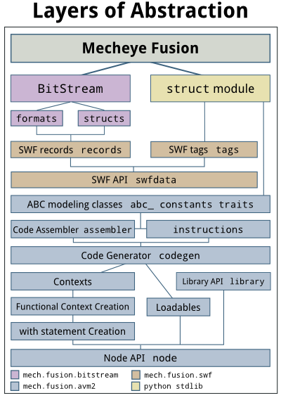

1Layers of Abstraction
======================

Starting at the core, Fusion has a bunch of layers of abstraction to make
things easier. There's the raw `BitStream API`_, which consists of the `Formats
API`_ for atomic encoding formats that are readable and writable.

On top of the formats API is layered the `Structs API`_, which allows to piece
together formats into "fields" that the structs contain. The Structs API is
modeled after `hachoir`_, but enables both writing and reading as opposed to
just reading.

Currently, the only major thing that requires the bit-packed field support of
BitStream is SWF records, although the BitStream APIs are always used when
reading ABC and SWF files.

SWF tags are read using the BitStream API and written using a combination of
string manipulation and the struct module.

AVM2 support are where the real layers of abstraction start to form. The raw
layers of AVM2 support are the Abc\*Info classes, the AbcTrait classes, and the
:mod:`mech.fusion.avm2.constants` module defining all the objects needed for
the constant pool.

On top of that layer is the CodeAssembler in :mod:`mech.fusion.avm2.assembler`
and opcodes in :mod:`mech.fusion.avm2.instructions`. This layer allows you to
assemble the bytecode needed for method bodies.

The CodeGenerator in :mod:`mech.fusion.avm2.codegen` papers over the
CodeAssembler and instructions layer and makes common tasks and idioms, such as
branching and try/catch blocks, simpler.

The CodeGenerator uses several context objects to keep track of state and the
Abc*Info and AbcTrait objects it creates. There are currently two direct ways
to create the context objects: with methods on the CodeGenerator object, and
with context managers that call those methods, usable with the "with"
statement.

Yet, a more general and useful abstraction around this is the `Library API`_,
which is capable of reading pickled versions of ABC files and calling
functions.

.. _`BitStream API`: :ref:`bitstream/index-bitstream.rst`
.. _`Formats API`: :ref:`bitstream/formats`
.. _`Structs API`: :ref:`bitstream/structs`
.. _`hachoir`: http://bitbucket.org/haypo/hachoir/wiki/Home
